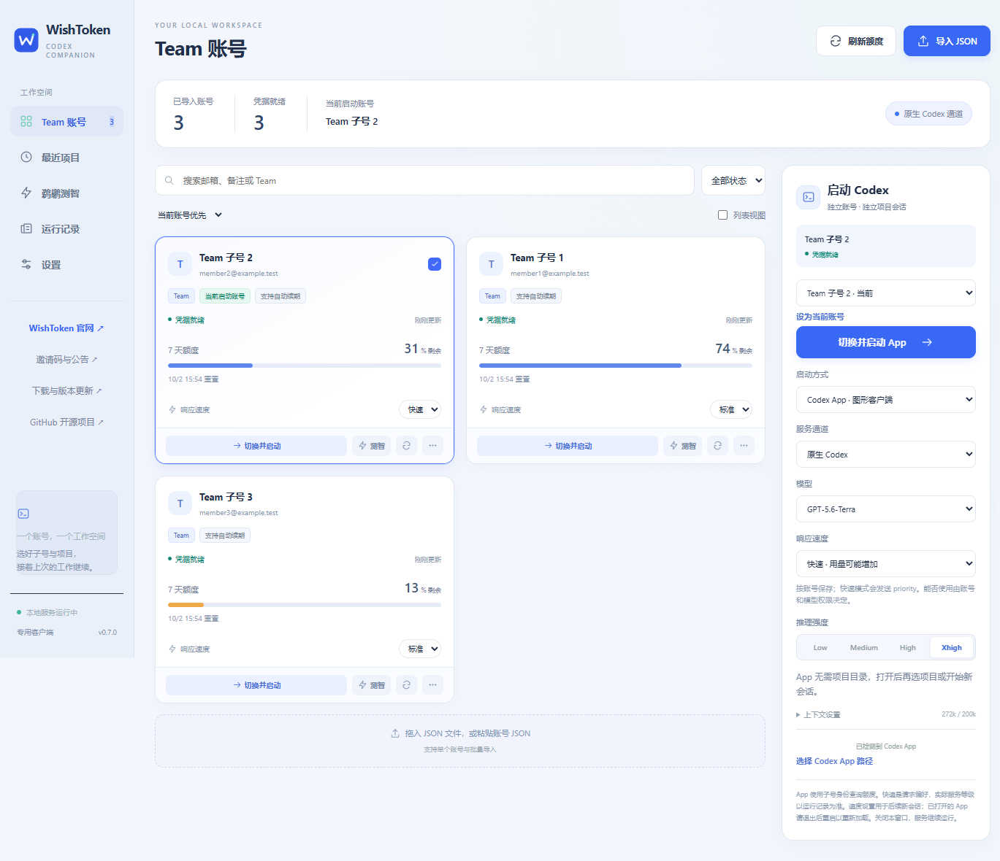

# WishToken Desktop

[English](README.en.md) · [下载客户端](https://github.com/xxx-holic/wishtoken-desktop/releases) · [WishToken 官网](https://wishtoken.team/?utm_source=github&utm_medium=readme) · [公告与邀请码](https://github.com/xxx-holic/wishtoken-desktop/discussions/categories/announcements)

WishToken 的开源 Codex 桌面配套工具。导入你有权使用的 Team 子号 JSON，查看额度、切换主 Codex App 账号，继续原有项目和已保存会话。也支持独立实例和 CLI。Windows、macOS 与 Linux 使用同一套界面和本地服务。

**[加入 Telegram 官方群](https://t.me/shouhouqun) · [开源赠送 10 个邀请码（2026-09-30）](https://github.com/xxx-holic/wishtoken-desktop/discussions/6)**

**账号留在本机。通道由你选择。请求结果可以核对。**



*界面示例使用合成账号与演示额度，不包含真实用户数据。*

## 功能

- 多账号导入：支持 Sub2API 导出、Codex auth JSON 及兼容的账号 JSON；搜索、备注、排序、额度进度和重置时间。
- 选择 BPS 或原生 Codex 通道，默认 BPS；会话固定账号与通道，失败不会静默改用另一通道。
- 一键切换并启动：默认切换主 Codex App，沿用原有项目、会话和应用数据；无需项目目录。首次接管备份配置，设置中可恢复；独立实例可手动选择。CLI 按账号和项目隔离。
- 原生通道可保存每个账号的标准／快速偏好。运行记录分别展示请求与上游返回的服务等级；请求快速不等于上游已分配快速。
- 鹈鹕作品对比：同提示词、模型和推理档位的多账号批测，支持取消、重试、历史、隔离预览及导出。
- 本地管理 API 鉴权、固定回环监听、受限 IPC、外部链接白名单、模型 HTML 预览隔离。

“不降智”是用户对这类工具的常见称呼。本项目能核对所选模型、推理档位、通道、工具往返和上游报告的字段，**不能证明上游内部使用了哪个模型，也不能保证输出质量**。鹈鹕作品是直观比较，不是 IQ 分数。

## 下载和开始使用

在 [Releases](https://github.com/xxx-holic/wishtoken-desktop/releases) 下载：

| 平台 | 文件 | 状态 |
| --- | --- | --- |
| Windows x64 | `WishToken-Desktop-<版本>-win-x64.exe` 或 `.zip` | 安装包 / 便携包，未签名 |
| macOS Apple Silicon | `WishToken-Desktop-<版本>-mac-arm64.zip` | macOS 13+，未签名、未公证测试包 |
| macOS Intel | `WishToken-Desktop-<版本>-mac-x64.zip` | macOS 13+，未签名、未公证测试包 |
| Linux x64 | `WishToken-Desktop-<版本>-linux-x64.AppImage`、`.deb`、`.tar.gz` | Ubuntu 24.04 原生构建；CLI 联动，GUI App 需另行安装兼容版本 |

1. 安装客户端，并另外安装官方 Codex App 或 CLI。客户端不会捆绑官方 Codex。
2. 导入自己的账号 JSON，点击刷新额度。
3. 选择账号、通道、模型与推理档位，点击“切换并启动”。App 无需填写目录。
4. 遇到 BPS 403 时查看错误；额度正常不代表 BPS 权限正常。可手动选择原生通道测试。

Linux 安装和系统终端要求见 [Linux 说明](docs/LINUX.md)。本项目提供 WishToken 客户端，不捆绑或承诺各平台的官方 Codex 图形应用。

详细操作、升级及平台限制见 [使用说明](docs/QUICKSTART.md)。Apple Silicon/Intel 的包结构和核心交叉编译可检查，但不等于已通过所有 Mac 实机场景；以每个版本的发布说明为准。

## WishToken 与邀请码

这是 [wishtoken.team](https://wishtoken.team/?utm_source=github&utm_medium=readme) 的专属开源配套客户端。[Telegram 官方群](https://t.me/shouhouqun) 用于交流与反馈。首批 [10 个赠送邀请码](https://github.com/xxx-holic/wishtoken-desktop/discussions/6) 已于 2026-09-30 发布，领取状态及使用规则以站点为准。后续不定期发放，以 [项目公告](https://github.com/xxx-holic/wishtoken-desktop/discussions/categories/announcements) 和官网为准。

客户端包含官网、邀请码公告、下载更新和 GitHub 入口。它不要求登录 WishToken 才能管理本地账号，不会自动把导入凭据发送给 WishToken。

## 从源码构建

需要 Go 1.25+、Node.js 24、npm。Go 核心没有第三方依赖，桌面采用 Electron 和原生 HTML/CSS/JS。

```sh
git clone https://github.com/xxx-holic/wishtoken-desktop.git
cd wishtoken-desktop
go vet ./...
go test ./...
cd desktop
npm ci
npm run backend
npm test
# Windows
npm run backend -- win32 x64
npm start
npm run dist:win
# macOS，在 Mac 上构建两种架构
npm run dist:mac
# Linux x64，在 Linux 上构建
npm run dist:linux
```

发布构建使用 GitHub Actions，生成独立平台产物和 `SHA256SUMS.txt`。版本发布和验证步骤见 [维护指南](CONTRIBUTING.md)。

## 隐私与贡献

本地数据默认位于 `~/.gptbridge-desktop`，沿用早期版本路径以支持升级。该目录包含敏感凭据，不应提交、分享或作为问题附件。详见 [隐私说明](docs/PRIVACY.md)、[安全报告](SECURITY.md) 与 [贡献指南](CONTRIBUTING.md)。

源码采用 MIT 许可证。Electron/Chromium 和参考项目的许可证、来源说明见 [NOTICE](NOTICE.md)。本项目与 OpenAI、Microsoft 无隶属或背书关系。
